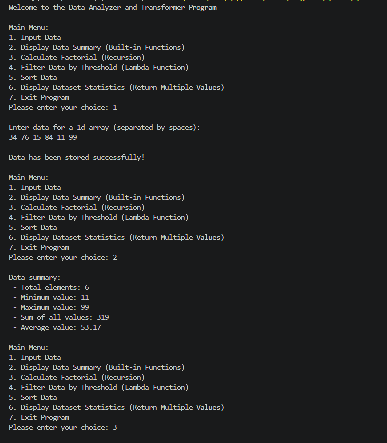
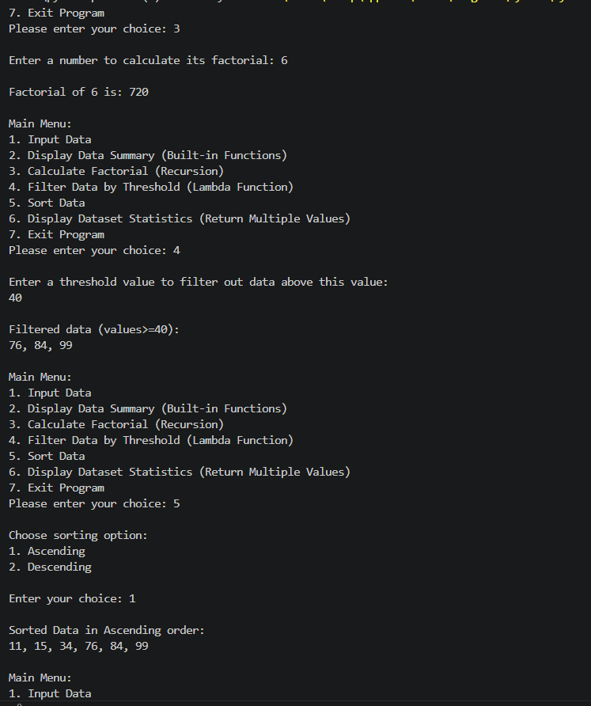
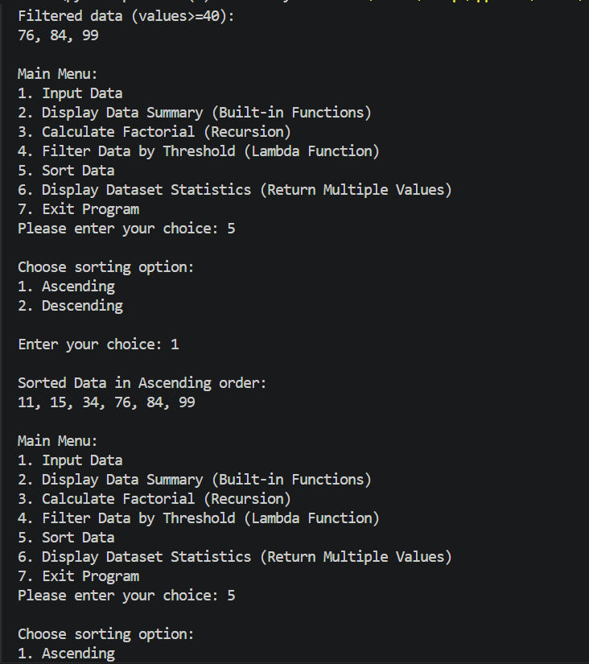
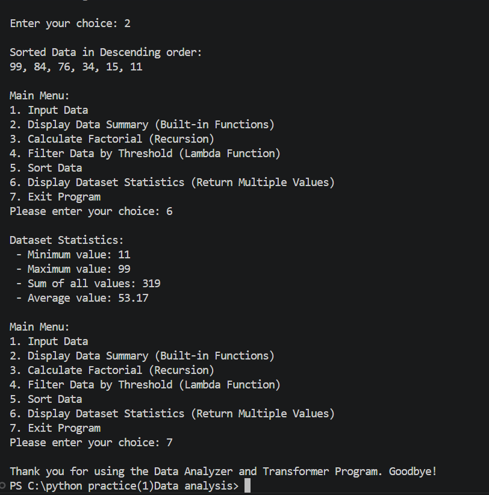

# PR4-Functional-Treat
# 📊 PR.4 Functional Treat – Data Analyzer and Transformer

## 📖 Project Description

The Data Analyzer and Transformer is a Python menu-driven application that allows users to perform different data analysis and transformation operations on 1D and 2D lists.

The project demonstrates the use of Python built-in functions, user-defined functions, recursion, lambda functions, sorting, global variables, *args, **kwargs, and return multiple values.

---

## ✨ Features

- Menu-driven interface
- Input 1D or 2D list
- Built-in functions
  - len()
  - sum()
  - min()
  - max()
- Calculate average using UDF
- Factorial using Recursion
- Lambda with filter() and map()
- Sorting (Ascending & Descending)
- Dataset Summary using **kwargs
- Global variable implementation
- Return multiple values from function
- Function documentation using __doc__

---

## 🛠️ Technologies Used

- Python 3.x
- VS Code
- Git
- GitHub

---

## 📂 Project Structure

```
├── pr4_functional_treat.py
├── README.md
├── screenshots/
```

---

## ▶️ How to Run

1. Open the project in VS Code.
2. Run the `main.py` file.
3. Select options from the menu.
4. Enter 1D  data.
5. Perform analysis and transformations.

---

## 📋 Functionalities

### Built-in Functions
- Length
- Sum
- Minimum
- Maximum

### User Defined Functions
- Average
- Unique Values
- Duplicate Values

### Recursion
- Factorial

### Lambda Functions
- Filter values
- Map values

### Sorting
- Ascending Order
- Descending Order

### Dataset Statistics
- Minimum
- Maximum
- Sum
- Average

---

## 📸 Output Screenshots





## 🎥 Project Demo Video

**Video Link:**

## 📌 Learning Outcomes

This project helped me learn:

- Functions
- Built-in Functions
- User Defined Functions
- Lambda Functions
- Recursion
- Sorting
- List Operations
- *args and **kwargs
- Global Keyword
- Return Multiple Values
- Documentation (__doc__)

---
